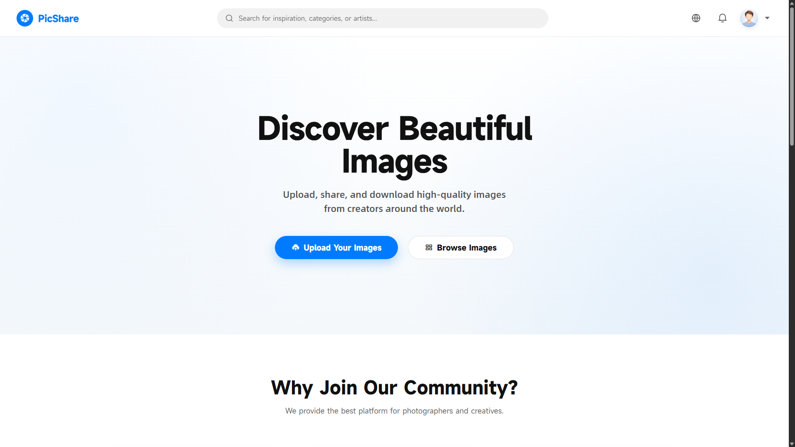
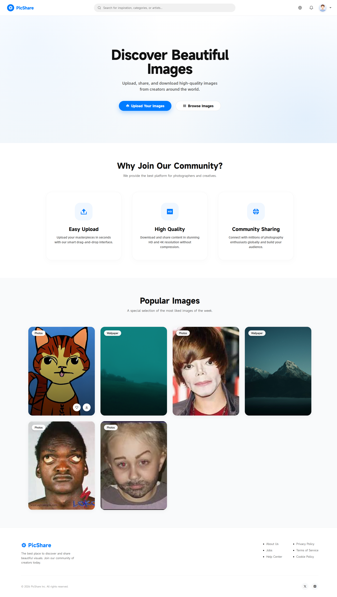
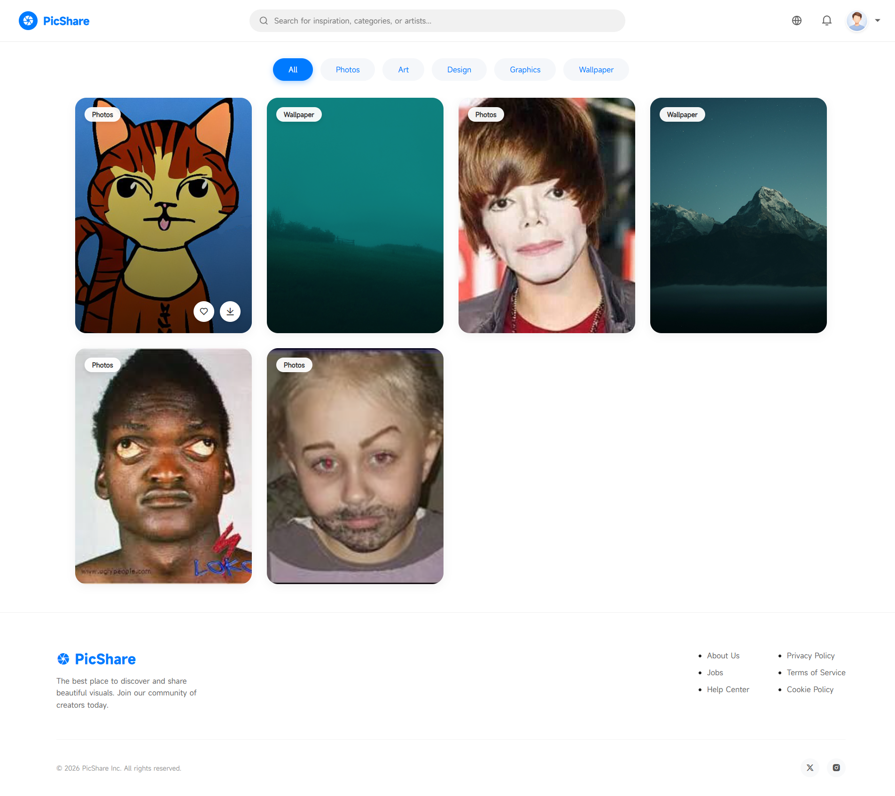

# PicShare - Discover Beautiful Images

  

## Português (PT-BR)

PicShare é uma plataforma de compartilhamento de imagens que permite aos usuários publicar, explorar e baixar conteúdos visuais de forma simples e intuitiva.

Entre os principais recursos do PicShare estão:

- Publicação e compartilhamento de imagens.
- Exploração de conteúdos enviados pela comunidade.
- Download de imagens disponibilizadas pelos usuários.
- Interface moderna e responsiva para diferentes dispositivos.
- Sistema focado na descoberta e organização de conteúdo visual.

O objetivo do PicShare é criar um ambiente acessível para que fotógrafos, artistas, designers e entusiastas possam compartilhar seus trabalhos, encontrar inspiração e divulgar suas criações para uma comunidade cada vez maior.

## English (EN)

PicShare is an image-sharing platform that allows users to publish, explore, and download visual content in a simple and intuitive way.

Some of PicShare's main features include:

- Uploading and sharing images.
- Exploring content shared by the community.
- Downloading images made available by users.
- A modern and responsive interface for different devices.
- A system focused on visual content discovery and organization.

The goal of PicShare is to provide an accessible environment where photographers, artists, designers, and enthusiasts can share their work, find inspiration, and showcase their creations to a growing community.

## CAPTURAS DE TELAS / SCREENSHOTS

  
  

